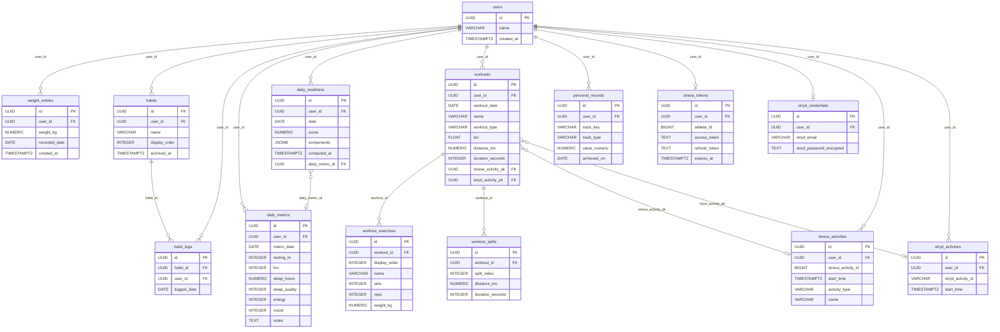

# Data Model Reference

Canonical human-readable schema reference for perf-coach. Source of truth is
`backend/models.py`; Alembic migrations in `alembic/versions/` have been
cross-checked and take precedence on any conflict.

---

## Users and Auth

### `users`

Identity record for each dashboard user.

| Column | Type | Constraints |
|--------|------|-------------|
| `id` | `UUID` | PK, `DEFAULT gen_random_uuid()` |
| `name` | `VARCHAR(100)` | NOT NULL, UNIQUE |
| `email` | `VARCHAR(255)` | nullable |
| `created_at` | `TIMESTAMPTZ` | `DEFAULT now()` |

---

### `user_preferences`

Per-user performance and display preferences. One row per user; auto-created on
first `GET /api/user-preferences` if absent. Defaults: `ftp_w=280`,
`threshold_hr=170`, `threshold_pace_seconds_per_km=270`, `preferred_units=metric`,
`timezone=Asia/Bangkok`, `week_start_day=1`, `date_format=YYYY-MM-DD`.

| Column | Type | Constraints |
|--------|------|-------------|
| `id` | `UUID` | PK, `DEFAULT gen_random_uuid()` |
| `user_id` | `UUID` | NOT NULL, UNIQUE, FK → `users.id` CASCADE |
| `ftp_w` | `INTEGER` | nullable; functional threshold power (watts) |
| `threshold_hr` | `INTEGER` | nullable; threshold heart rate (bpm) |
| `threshold_pace_seconds_per_km` | `INTEGER` | nullable; threshold pace |
| `preferred_units` | `VARCHAR(20)` | NOT NULL, `DEFAULT 'metric'` |
| `timezone` | `VARCHAR(100)` | NOT NULL, `DEFAULT 'Asia/Bangkok'` |
| `week_start_day` | `INTEGER` | NOT NULL, `DEFAULT 1`; 1=Monday … 7=Sunday |
| `display_name` | `VARCHAR(100)` | nullable |
| `date_format` | `VARCHAR(20)` | NOT NULL, `DEFAULT 'YYYY-MM-DD'` |
| `created_at` | `TIMESTAMPTZ` | `DEFAULT now()` |
| `updated_at` | `TIMESTAMPTZ` | `DEFAULT now()` |

---

### `daily_metrics`

One row per user per calendar day capturing wellness snapshot values.

| Column | Type | Constraints |
|--------|------|-------------|
| `id` | `UUID` | PK, `DEFAULT gen_random_uuid()` |
| `user_id` | `UUID` | NOT NULL, FK → `users.id` CASCADE |
| `metric_date` | `DATE` | NOT NULL |
| `resting_hr` | `INTEGER` | nullable; CHECK 20–200 |
| `hrv` | `INTEGER` | nullable; CHECK 0–300 |
| `sleep_hours` | `NUMERIC(3,1)` | nullable; CHECK 0–24 |
| `sleep_quality` | `INTEGER` | nullable; CHECK 1–5 |
| `energy` | `INTEGER` | nullable; CHECK 1–5 |
| `mood` | `INTEGER` | nullable; CHECK 1–5 |
| `notes` | `TEXT` | nullable |
| `created_at` | `TIMESTAMPTZ` | `DEFAULT now()` |
| `updated_at` | `TIMESTAMPTZ` | `DEFAULT now()` |

**Unique constraint:** `(user_id, metric_date)` — one row per user per day.

---

### `daily_readiness`

Computed readiness score derived from the day's wellness metrics; one row per
user per calendar day.

| Column | Type | Constraints |
|--------|------|-------------|
| `id` | `UUID` | PK, `DEFAULT gen_random_uuid()` |
| `user_id` | `UUID` | NOT NULL, FK → `users.id` CASCADE |
| `date` | `DATE` | NOT NULL |
| `score` | `NUMERIC(5,2)` | NOT NULL; CHECK 0–100 |
| `components` | `JSONB` | NOT NULL; breakdown of contributing signals |
| `computed_at` | `TIMESTAMPTZ` | NOT NULL, `DEFAULT now()` |
| `daily_metric_id` | `UUID` | nullable; FK → `daily_metrics.id` SET NULL |

**Unique constraint:** `(user_id, date)`.

---

### `weight_entries`

Body-weight log entries, one per user per day.

| Column | Type | Constraints |
|--------|------|-------------|
| `id` | `UUID` | PK, `DEFAULT gen_random_uuid()` |
| `user_id` | `UUID` | NOT NULL, FK → `users.id` |
| `weight_kg` | `NUMERIC(5,2)` | NOT NULL |
| `recorded_date` | `DATE` | NOT NULL |
| `created_at` | `TIMESTAMPTZ` | `DEFAULT now()` |

**Unique constraint:** `(user_id, recorded_date)`.

---

### `habits`

Habit definitions owned by a user. Supports soft-archiving via `archived_at`.

| Column | Type | Constraints |
|--------|------|-------------|
| `id` | `UUID` | PK, `DEFAULT gen_random_uuid()` |
| `user_id` | `UUID` | NOT NULL, FK → `users.id` |
| `name` | `VARCHAR(100)` | NOT NULL |
| `display_order` | `INTEGER` | NOT NULL, `DEFAULT 0` |
| `created_at` | `TIMESTAMPTZ` | `DEFAULT now()` |
| `archived_at` | `TIMESTAMPTZ` | nullable; set when habit is soft-deleted |

---

### `habit_logs`

One row per (habit, date) pair marking the habit as completed that day.

| Column | Type | Constraints |
|--------|------|-------------|
| `id` | `UUID` | PK, `DEFAULT gen_random_uuid()` |
| `habit_id` | `UUID` | NOT NULL, FK → `habits.id` |
| `user_id` | `UUID` | NOT NULL, FK → `users.id` |
| `logged_date` | `DATE` | NOT NULL |
| `created_at` | `TIMESTAMPTZ` | `DEFAULT now()` |

**Unique constraint:** `(habit_id, logged_date)`.

---

## Training

### `workouts`

Top-level workout session record. Supports manual entry, Strava import, and
Stryd import; `source` tracks the origin. FK columns `strava_activity_pk` and
`stryd_activity_pk` link to raw activity records in the integrations tables.

| Column | Type | Constraints |
|--------|------|-------------|
| `id` | `UUID` | PK, `DEFAULT gen_random_uuid()` |
| `user_id` | `UUID` | NOT NULL, FK → `users.id` CASCADE |
| `workout_date` | `DATE` | NOT NULL |
| `name` | `VARCHAR(200)` | NOT NULL |
| `workout_type` | `VARCHAR(50)` | NOT NULL |
| `remarks` | `TEXT` | nullable |
| `tss` | `FLOAT` | nullable; CHECK ≥ 0 |
| `tss_source` | `VARCHAR(20)` | nullable; CHECK IN (`manual`, `calculated`) |
| `source` | `VARCHAR(20)` | nullable; CHECK IN (`manual`, `strava`, `stryd`, `strava,stryd`, `stryd,strava`, `both`) |
| `strava_activity_url` | `TEXT` | nullable |
| `distance_km` | `NUMERIC(8,3)` | nullable; CHECK ≥ 0 |
| `duration_seconds` | `INTEGER` | nullable; CHECK ≥ 0 |
| `avg_hr` | `INTEGER` | nullable; CHECK 20–250 |
| `max_hr` | `INTEGER` | nullable; CHECK 20–250 |
| `elevation_m` | `INTEGER` | nullable |
| `start_time` | `TIMESTAMPTZ` | nullable |
| `strava_activity_pk` | `UUID` | nullable; FK → `strava_activities.id` SET NULL |
| `stryd_activity_pk` | `UUID` | nullable; FK → `stryd_activities.id` SET NULL |
| `manual_overrides` | `JSONB` | nullable; fields manually edited after import |
| `created_at` | `TIMESTAMPTZ` | `DEFAULT now()` |

**Check constraints:** `tss_source` and `source` use fixed enum values enforced
at DB level. `avg_hr` / `max_hr` range 20–250 matches physiological limits.

---

### `workout_exercises`

Individual exercise sets within a workout, ordered by `display_order`.

| Column | Type | Constraints |
|--------|------|-------------|
| `id` | `UUID` | PK, `DEFAULT gen_random_uuid()` |
| `workout_id` | `UUID` | NOT NULL, FK → `workouts.id` CASCADE |
| `display_order` | `INTEGER` | NOT NULL, `DEFAULT 0` |
| `name` | `VARCHAR(200)` | NOT NULL |
| `sets` | `INTEGER` | nullable; CHECK > 0 |
| `reps` | `INTEGER` | nullable |
| `weight_kg` | `NUMERIC(6,2)` | nullable |
| `duration` | `VARCHAR(50)` | nullable; human-readable duration string |
| `rpe` | `INTEGER` | nullable; CHECK 1–10 |
| `distance_km` | `NUMERIC(8,3)` | nullable; CHECK ≥ 0 |
| `duration_seconds` | `INTEGER` | nullable; CHECK ≥ 0 |
| `avg_hr` | `INTEGER` | nullable; CHECK 20–250 |
| `created_at` | `TIMESTAMPTZ` | `DEFAULT now()` |

---

### `workout_splits`

Per-kilometre (or per-mile) splits for a workout, ordered by `split_index`.

| Column | Type | Constraints |
|--------|------|-------------|
| `id` | `UUID` | PK, `DEFAULT gen_random_uuid()` |
| `workout_id` | `UUID` | NOT NULL, FK → `workouts.id` CASCADE |
| `split_index` | `INTEGER` | NOT NULL |
| `distance_km` | `NUMERIC(6,3)` | NOT NULL |
| `duration_seconds` | `INTEGER` | NOT NULL |
| `avg_hr` | `INTEGER` | nullable |
| `created_at` | `TIMESTAMPTZ` | `DEFAULT now()` |
| `updated_at` | `TIMESTAMPTZ` | `DEFAULT now()` |

**Unique constraint:** `(workout_id, split_index)`.

---

### `personal_records`

Best-ever values per tracked metric per user. `track_type` determines whether
`value_numeric` is a time in seconds (`time`) or a weight in kg (`weight`).

| Column | Type | Constraints |
|--------|------|-------------|
| `id` | `UUID` | PK, `DEFAULT gen_random_uuid()` |
| `user_id` | `UUID` | NOT NULL, FK → `users.id` CASCADE |
| `track_key` | `VARCHAR(100)` | NOT NULL; machine-readable key, e.g. `5k_run` |
| `track_name` | `VARCHAR(200)` | NOT NULL; display name |
| `track_type` | `VARCHAR(10)` | NOT NULL; CHECK IN (`time`, `weight`) |
| `value_numeric` | `NUMERIC(12,4)` | NOT NULL; CHECK > 0 |
| `achieved_on` | `DATE` | NOT NULL |
| `source` | `VARCHAR(100)` | nullable; e.g. activity ID or manual |
| `created_at` | `TIMESTAMPTZ` | `DEFAULT now()` |
| `updated_at` | `TIMESTAMPTZ` | `DEFAULT now()` |

---

## Integrations

### `strava_tokens`

OAuth 2.0 token storage for Strava. One row per user; `unique=True` on
`user_id` enforces single-token-per-user at DB level. `athlete_data` caches the
Strava athlete profile payload to avoid redundant API calls.

| Column | Type | Constraints |
|--------|------|-------------|
| `id` | `UUID` | PK, `DEFAULT gen_random_uuid()` |
| `user_id` | `UUID` | NOT NULL, UNIQUE, FK → `users.id` CASCADE |
| `athlete_id` | `BIGINT` | NOT NULL |
| `access_token` | `TEXT` | NOT NULL |
| `refresh_token` | `TEXT` | NOT NULL |
| `expires_at` | `TIMESTAMPTZ` | NOT NULL |
| `scope` | `VARCHAR(255)` | nullable |
| `athlete_data` | `JSONB` | nullable |
| `created_at` | `TIMESTAMPTZ` | `DEFAULT now()` |
| `updated_at` | `TIMESTAMPTZ` | `DEFAULT now()` |

---

### `stryd_credentials`

Stryd account credentials (email + AES-encrypted password). One row per user;
`session_token` is refreshed on each Stryd API call.

| Column | Type | Constraints |
|--------|------|-------------|
| `id` | `UUID` | PK, `DEFAULT gen_random_uuid()` |
| `user_id` | `UUID` | NOT NULL, UNIQUE, FK → `users.id` CASCADE |
| `stryd_email` | `VARCHAR(255)` | NOT NULL |
| `stryd_password_encrypted` | `TEXT` | NOT NULL; AES-encrypted at application layer |
| `session_token` | `TEXT` | nullable; refreshed per sync |
| `session_token_expires_at` | `TIMESTAMPTZ` | nullable |
| `athlete_id` | `BIGINT` | nullable |
| `created_at` | `TIMESTAMPTZ` | `DEFAULT now()` |
| `updated_at` | `TIMESTAMPTZ` | `DEFAULT now()` |

---

### `strava_activities`

Raw Strava activity records synced from the Strava API. `raw_payload` stores
the full API response. `is_stryd_synced` flags whether a matching Stryd
activity has been linked.

| Column | Type | Constraints |
|--------|------|-------------|
| `id` | `UUID` | PK, `DEFAULT gen_random_uuid()` |
| `user_id` | `UUID` | NOT NULL, FK → `users.id` CASCADE |
| `strava_activity_id` | `BIGINT` | NOT NULL, UNIQUE, indexed |
| `start_time` | `TIMESTAMPTZ` | NOT NULL, indexed |
| `activity_type` | `VARCHAR(50)` | NOT NULL |
| `name` | `VARCHAR(255)` | NOT NULL |
| `distance_km` | `NUMERIC(10,3)` | nullable |
| `duration_seconds` | `INTEGER` | nullable |
| `avg_hr` | `INTEGER` | nullable |
| `max_hr` | `INTEGER` | nullable |
| `elevation_m` | `INTEGER` | nullable |
| `avg_power_w` | `INTEGER` | nullable |
| `max_power_w` | `INTEGER` | nullable |
| `device_name` | `VARCHAR(255)` | nullable |
| `external_id` | `VARCHAR(255)` | nullable |
| `is_stryd_synced` | `BOOLEAN` | NOT NULL, `DEFAULT false` |
| `raw_payload` | `JSONB` | NOT NULL |
| `synced_at` | `TIMESTAMPTZ` | NOT NULL, `DEFAULT now()` |

**Indexes:** `strava_activity_id` (unique), `start_time`, composite
`(user_id, start_time)` (`ix_strava_activities_user_start_time`).

---

### `stryd_activities`

Raw Stryd activity records synced from the Stryd API. `form_metrics`,
`power_zones`, and `splits` are JSONB payloads from the Stryd response.
`raw_payload` stores the full response.

| Column | Type | Constraints |
|--------|------|-------------|
| `id` | `UUID` | PK, `DEFAULT gen_random_uuid()` |
| `user_id` | `UUID` | NOT NULL, FK → `users.id` CASCADE |
| `stryd_activity_id` | `VARCHAR(255)` | NOT NULL, UNIQUE, indexed |
| `start_time` | `TIMESTAMPTZ` | NOT NULL, indexed |
| `name` | `VARCHAR(255)` | nullable |
| `distance_km` | `NUMERIC(10,3)` | nullable |
| `duration_seconds` | `INTEGER` | nullable |
| `avg_power_w` | `INTEGER` | nullable |
| `avg_hr` | `INTEGER` | nullable |
| `tss` | `INTEGER` | nullable |
| `form_metrics` | `JSONB` | nullable |
| `power_zones` | `JSONB` | nullable |
| `splits` | `JSONB` | nullable |
| `raw_payload` | `JSONB` | NOT NULL |
| `synced_at` | `TIMESTAMPTZ` | NOT NULL, `DEFAULT now()` |

**Indexes:** `stryd_activity_id` (unique), `start_time`, composite
`(user_id, start_time)` (`ix_stryd_activities_user_start_time`).

---

## Entity-Relationship Diagram

---

## Future Changes

Upcoming schema work tracked in open GitHub issues:

- **Issue #217 — Add `sleep_imports` table and `SleepImport` model:** A new
  `sleep_imports` table will be added to store imported sleep data records.
  Will require a new Alembic migration.

- **Issue #214 — Add Google OAuth credentials storage model and migration:**
  A new table (tentatively `google_oauth_credentials`) will store Google OAuth
  tokens, mirroring the pattern of `strava_tokens` and `stryd_credentials`.
  Will require a new Alembic migration.
